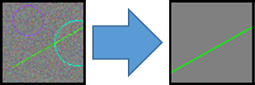
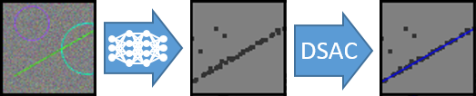
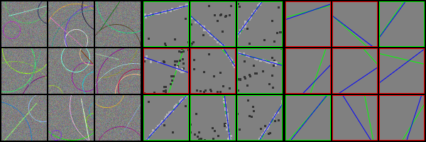
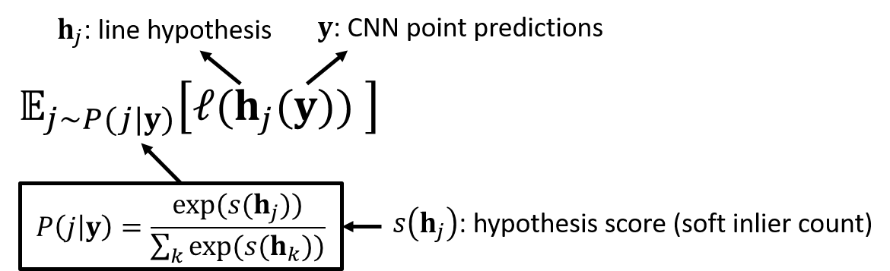
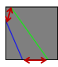

# Differentiable RANSAC: Learning Robust Line Fitting

- [Introduction](#introduction)
- [Running the Code](#running-the-code)
- [How Does It Work?](#how-does-it-work?)
- [Code Structure](#code-structure)
- [Publications](#publications)

## Introduction

This code illustrates the principles of differentiable RANSAC (DSAC) on a simple toy problem of fitting lines to noisy, synthetic images. 



**Left:** Input image. **Right:** Ground truth line.

We solve this task by training a CNN which predicts a set of 2D points within the image. 
We fit our desired line to these points using RANSAC.



**Left:** Input image. **Center:** Points predicted by a CNN. **Right:** Line (blue) fitted to predictions.

Ideally, the CNN would place all its point predictions on the image line segment.
But because RANSAC is robust to outlier points, the CNN may choose to allow some erroneous predictions in favor of overall accuracy. 

We train the CNN end-to-end from scratch to minimize the deviation between the (robustly) fitted line and the ground truth line.

## Running the Code

Just execute `python main.py` to start a training run with the standard settings. 
Running `python main.py -h` will list all parameter options for playing around.

The code generates training data on the fly, and trains two CNNs ins parallel. 
The first CNN predicts a set of 2D points to which the output line is fitted using DSAC.
The second CNN is a baseline where the line parameters are predicted directly, i.e. without DSAC.

In a specified interval during training, both CNNs are tested on a fixed validation set, and the vizualisation of the predictions is stored in an images such as the following:



**Left:** Validation inputs. **Center:** DSAC estimates with dots marking the CNN prediction, blue the fitted line and green the ground truth line. Green borders mark accurate line predictions, red boxes mark inaccurate line predictions (there is a threshold parameter). **Right:** Predictions of the baseline CNN (direct prediction of line parameters).

### Dependencies

This code requires the following packages, and was tested with the package version in brackets.

`pytorch (0.5.0)`, `torchvision (0.2.1)`, `scikit-image (0.14.0)`

### Training Speed

Depending on your system specification, one training iteration (with the standard batch size of 32) can take more than one second.
This might seem excessive for a simple toy problem.
Note that this code is designed for educative clarity rather than speed. 
The whole DSAC portion of training runs in native Python on a single CPU core, and backpropagation relies soley on standard PyTorch autograd.
In any production setting, one would write a C++/CUDA extension encapsulating DSAC for a huge runtime boost.
See for example our camera localization pipelines which utilize DSAC [here](https://github.com/cvlab-dresden/DSAC) and [here](https://github.com/vislearn/LessMore).

## How Does It Work?

Vanilla RANSAC works by creating a set of model hypotheses (line hypotheses in our case), scoring them e.g. by inlier counting, and selecting the best one.

DSAC is based on the idea of making hypothesis selection a probabilistic action. 
The probability of selecting a hypothesis increases with its score (e.g. inlier count).
Training the CNN aims at minimizing the expected loss of the selected hypothesis. 



More details and a formal description can be found in the papers referenced at the end of this document. 

In a nutshell, the training process works like this:

1. CNN predicts 2D points
2. sample line hypotheses by choosing random pairs of points
3. score hypotheses by soft inlier counting, and calculate selection probabilities
4. refine hypotheses by re-fitting them to their soft inliers
5. calculate expected loss of refined hypotheses w.r.t. selection probabilities
6. backprob, update CNN, repeat

### Loss Function

For this toy problem, we are interested in observing visually nicely aligned lines rather then the nominal error in line parameters. 
We thus measure the maximum distance between the predicted line and ground truth within the image, and aim at minimizing this distance as our loss function.



Red arrows mark the error between ground truth line (green) and estimated line (blue) that we try to minimize.

## Code Structure

`main.py` Main script that handles the training loop.

`dsac.py` Encapsulates robust, differentiable line fitting with DSAC (sampling hypotheses, scoring, refinement, expected loss).

`line_dataset.py` Generates random, noisy input images with associated ground truth parameters. Also includes functions for vizualising predictions.

`line_loss.py` Loss function used to compare predicted and ground truth lines.

`line_nn.py` Definition of the CNN architecture which supports prediction of 2D points or direct regression of line parameters.

## Publications

The following paper introduced DSAC for camera localization ([paper link](https://arxiv.org/abs/1611.05705)).

```
@inproceedings{brachmann2017dsac,
  title={{DSAC}-{Differentiable RANSAC} for Camera Localization},
  author={Brachmann, Eric and Krull, Alexander and Nowozin, Sebastian and Shotton, Jamie and Michel, Frank and Gumhold, Stefan and Rother, Carsten},
  booktitle={CVPR},
  year={2017}
}
```

This code uses a soft inlier count instead of a learned scoring function, as suggested in the following paper ([paper link](https://arxiv.org/abs/1711.10228)).

```
@inproceedings{brachmann2018lessmore,
  title={Learning Less is More-{6D} Camera Localization via {3D} Surface Regression},
  author={Brachmann, Eric and Rother, Carsten},
  booktitle={CVPR},
  year={2018}
}
```

Please cite one of these papers if you use DSAC or parts of this code in your own work.
